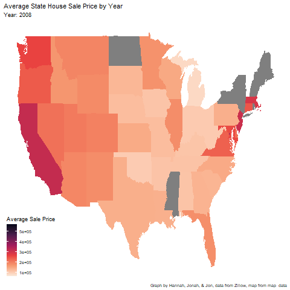

```{r setup, include=FALSE} 
knitr::opts_chunk$set(warning = FALSE, message = FALSE) 
```


```{r}
library(tidyverse)     
library(gardenR)      
library(lubridate)   
library(openintro)     
library(patchwork)    
library(rvest)        
library(robotstxt)  
library(janitor)    
library(maps)        
library(ggmap)        
library(gplots)       
library(RColorBrewer) 
library(sf)          
library(leaflet)       
library(ggthemes)     
library(plotly)       
library(gganimate)    
library(transformr)   
library(gifski)      
library(shiny)
library(ggrepel)
theme_set(theme_minimal())
```


### United States Housing and its Prices

Housing in the United States plays a crucial role in reflecting our economy. As housing prices represent neighborhood value, the money poured into housing directly impacts other essential aspects of community development. Things like green space, schools, and public transit all hold significant impacts on the desirability of neighborhoods, thus directly affecting housing prices and public funding. In other words, aspects of the community affect the housing prices and the housing prices affect the aspects of the community. Recently, Americans are facing a national surge in housing prices. We will attempt to look at data on housing prices in America to either confirm or deny this claim.
	According to Pew Research Center, nearly 50% of Americans say that affordable housing has become a major problem. While this issue can be seen all across the country and across all age demographics, the problem is most prevalent among young people in urban areas. Cities like New York, Los Angeles, and Boston have become almost completely unaffordable for someone working an entry or lower-level job, forcing people to expand further and further outside city lines. In fact, people in Seattle can qualify for housing assistance even when their salary is into the six figures.
	Despite this vast need for more homes, government spending tends to cater to amenities in already wealthy neighborhoods, rather than affordable units in newly gentrified and increasingly inaccessible areas; Even when government spending goes towards housing it usually tends to housing assistance, not the creation of new affordable housing.  Rather than focusing on building more duplexes, affordable apartments, mother-in-law units, and other diverse housing options, we have seen a rapid rise in expensive luxury apartments. And with the inventory of available homes to purchase falling to an all time low of 860,000 in December of last year, landlords can raise the prices of already expensive properties even more.
	
#### Yearly Housing Price Trends	

	Pictured in an animated map below, we can see the upward trend of housing prices across the US. With the darker shades representing higher prices, it is clear that states with more densely populated urban areas have higher prices on average. Additionally, you can see that the upward trend of prices spreads across the entirety of the US, emphasizing the need for increased housing nationwide. While this alone can not confirm our claim, it provides steady evidence not to deny what other reputable news organizations have published about housing. Our map also does the same for the claim about urban cities; it provides solid evidence for the fact that young people living in urban areas could suffer the most from extreme housing prices. With this knowledge in hand, we thought about what other phenomenon we could study while using the tools of data science to extract knowledge from the housing prices data. As a result, we decided to look at smaller scale phenomena, such as natural disasters, that could potentially affect housing prices in specific locations. For this project, we will examine 5 incidents across different places in the US and look at their potential correlations to changes in the housing market. 

 
```{r}
onebed_rent <- read_csv("City_MedianRentalPrice_1Bedroom.csv")
state_price <- read_csv("Sale_Prices_State.csv")

state_price_averages <- state_price %>% 
  mutate( "2008" = rowMeans(select(.,`2008-03`:`2008-12`)), na.rm=TRUE,
          "2009" = rowMeans(select(.,`2009-01`:`2009-12`)), na.rm=TRUE,
          "2010" = rowMeans(select(.,`2010-01`:`2010-12`)), na.rm=TRUE,
          "2011" = rowMeans(select(.,`2011-01`:`2011-12`)), na.rm=TRUE,
          "2012" = rowMeans(select(.,`2012-01`:`2012-12`)), na.rm=TRUE,
          "2013" = rowMeans(select(.,`2013-01`:`2013-12`)), na.rm=TRUE,
          "2014" = rowMeans(select(.,`2014-01`:`2014-12`)), na.rm=TRUE,
          "2015" = rowMeans(select(.,`2015-01`:`2015-12`)), na.rm=TRUE,
          "2016" = rowMeans(select(.,`2016-01`:`2016-12`)), na.rm=TRUE,
          "2017" = rowMeans(select(.,`2017-01`:`2017-12`)), na.rm=TRUE,
          "2018" = rowMeans(select(.,`2018-01`:`2018-12`)), na.rm=TRUE,
          "2019" = rowMeans(select(.,`2019-01`:`2019-12`)), na.rm=TRUE) %>% 
  select(RegionName, "2008", "2009", "2010", "2011", "2012", "2013", "2014", "2015", "2016", "2017", "2018", "2019")

mean_price_year <- state_price_averages %>% 
  pivot_longer(cols = -RegionName,
    names_to = "years")
```


```{r, fig.alt= "This animated graph shows the average sale price of houses, by state, for each year 2008-2019. The most expensive homes were consistently found in California each year, and the most inexpensive homes are are found in Oklahoma. The more expensive the average price, the darker it is. The average sale price increases for most homes over this time period. When there is no data the states are gray."}

states_map<- map_data("state") 

state_price_year <- mean_price_year %>% 
  mutate(RegionName = str_to_lower(`RegionName`)) %>% 
  group_by(years) %>% 
  arrange(years) %>% 
  ggplot() + 
  geom_map(map = states_map,
           aes(map_id = RegionName,
               fill = value,
               group = years),
               na.rm = TRUE) +
  labs(title = "Average State House Sale Price by Year", 
       subtitle = "Year: {closest_state}",
       fill = "Average Sale Price", 
       caption = "Graph by Hannah, Jonah, & Jon, data from Zillow, map from map_data") +
  expand_limits(x = states_map$long, y = states_map$lat) + 
  scale_fill_viridis_c(option = "rocket", direction = -1, labels = scales::comma) +
  theme_map() + 
  theme(legend.background = element_blank()) +
 transition_states(years, transition_length = 0)

state_price_year

animate(state_price_year, nframes = 200, end_pause = 10) 

```

```{r}
anim_save("state_price_year.gif")
```


```{r}

```

#### Potential Impacts to Housing Prices

Before we examine these specific catalysts for potential changes in housing prices, we must introduce the background of the catalysts, and why we have interest in them. Specifically, we look to natural disasters.
With this data, we wanted to explore the impact of natural disasters on various states. Hurricanes, tornados, and wildfires all drastically impact housing availability and therefore are directly tied to the housing market. While of course there are many other factors that impact housing prices, we thought it would be interesting to look at the years before and after major natural disasters in the US to see how the housing market could have been impacted.
	Pictures below is a graph showing the housing prices for states all along the east coast before and after Hurricane Sandy. This 2012 hurricane lasted from October 22nd to November 2nd and caused over $65 billion dollars in damages nationwide. With most of its impact being concentrated on the east coast, we can see the effect of the storm on housing availability. Among all of the states affected, New York and New Jersey were hit the hardest and faced a massive loss of homes and infrastructure. 
	Surprisingly, when we examined the data from this time frame for states all across the East Coast, we found that there was a pretty minimal impact on the prices of homes. The biggest increase in prices were in Maryland and Georgia, but because they are relatively small, we would not claim for Hurricane Sandy to be responsible for this increase. We think that because of the vast differences in damage caused in different cities and towns, the housing market across entire states may not have seen many changes.


```{r, fig.width = 14, fig.height = 5, fig.alt = "This is a line graph showing the average sale price of a house for each state, by month. The months included span from June 2012, to June 2013. The states included are Florida, Georgia, South Carolina, North Carolina, Virginia, Maryland, Deleware, Pennsylvania, New Jersey, New York, Connceticut, Rhode Island, Massacheusettes, New Hampshire, and Maine. There is a dot at Octocber, 2012, to indicate the time when Hurricane Sandy hit these states. The sale price for most states have minimal change with some states slightly increasing and some states slightly decreasing, and others remaining constant."}

price_by_month <- state_price %>% 
  pivot_longer(cols = -c("RegionName", "...1", "RegionID", "SizeRank"),
    names_to = "month_average") %>% 
  select(RegionName, month_average, value)

data_for_sandy <- price_by_month %>% 
  filter(RegionName == c("florida", "georgia", "south carolina", "north carolina", "virginia", "maryland", "deleware", "pennsylvania", "new jersey", "new york", "connceticut", "rhode island", "massacheusettes", "new hampshire", "maine"))

sandy_labels <- price_by_month %>% 
   mutate(RegionName = str_to_lower(`RegionName`), 
         na.rm = TRUE) %>% 
  group_by(month_average) %>% 
  arrange(month_average) %>%
  filter(month_average == "2013-06",
         RegionName %in% c("florida", "georgia", "south carolina", "north carolina", "virginia", "maryland", "deleware", "pennsylvania", "new jersey", "new york", "connceticut", "rhode island", "massacheusettes", "new hampshire", "maine"))

sandy_points <- price_by_month %>% 
   mutate(RegionName = str_to_lower(`RegionName`), 
         na.rm = TRUE) %>% 
  group_by(month_average) %>% 
  arrange(month_average) %>%
  filter(month_average == "2012-10",
         RegionName %in% c("florida", "georgia", "south carolina", "north carolina", "virginia", "maryland", "deleware", "pennsylvania", "new jersey", "new york", "connceticut", "rhode island", "massacheusettes", "new hampshire", "maine"))

hurricane_sandy <- price_by_month %>% 
  mutate(RegionName = str_to_lower(`RegionName`), 
         na.rm = TRUE) %>% 
  group_by(month_average) %>% 
  arrange(month_average) %>%
  filter(month_average %in% c("2012-06","2012-07","2012-08","2012-09","2012-10","2012-11","2012-12","2013-01","2013-02","2013-03","2013-04","2013-05","2013-06"),
    RegionName %in% c("florida", "georgia", "south carolina", "north carolina", "virginia", "maryland", "deleware", "pennsylvania", "new jersey", "new york", "connceticut", "rhode island", "massacheusettes", "new hampshire", "maine")) %>% 
  ggplot(aes(y = value, 
             x = month_average,
             group = RegionName,
             color = RegionName)) +
  geom_line() +
  geom_point(data = sandy_points, color = "black", size = 1.5) + 
  labs(title = "Average State Sale Price by Month",
      x = "",
      y = "Average House Price",
      color = "State",
      fill = "Average Sale Price by Month", 
      caption = "Graph by Hannah, Jonah, & Jon, data from Zillow") +
  geom_label_repel(data = sandy_labels,
                   aes(label = RegionName),
                   na.rm = TRUE) +
  theme(legend.position = "none")

hurricane_sandy
```


Next, we wanted to look at how another hurricane may have affected a different, more concentrated area. We decided to look at Hurricane Harvey. This category 4 hurricane spanned across Texas from August 17 to September 3 in 2017.  This hurricane was the second-most costly hurricane to ever hit the US, causing $125 billion in damages and resulting in the deaths of 107 people. However, while the graph we have included below does show a rise in prices after this event, this increase was already happening before the hurricane struck, and cannot attribute the rise in prices to the destruction caused by Harvey. 

```{r, fig.width = 9, fig.height = 5, fig.alt= "This is a line graph showing the average sale price for Texas homes, by month. The months included span from March 2017, to March 2018. The state included is Texas. There is a dot at August and September, 2017, to indicate the time when Hurricane Harvey hit these states. The sale price for most states have minimal change with some states slightly increasing and some states slightly decreasing, and others remaining constant."}
 
harvey_points <- price_by_month %>% 
   mutate(RegionName = str_to_lower(`RegionName`), 
         na.rm = TRUE) %>% 
  group_by(month_average) %>% 
  arrange(month_average) %>%
  filter(month_average %in% c("2017-08","2017-09"),
         RegionName == "texas")


hurricane_harvey <- price_by_month %>% 
  mutate(RegionName = str_to_lower(`RegionName`), 
         na.rm = TRUE) %>% 
  group_by(month_average) %>% 
  arrange(month_average) %>% 
  filter(RegionName == "texas",
         month_average %in% c("2017-03","2017-04","2017-05","2017-06","2017-07","2017-08","2017-09","2017-10","2017-11","2017-12","2018-01","2018-02","2018-03")) %>% 
   ggplot(aes(y = value, 
             x = month_average,
             group = RegionName,
             color = RegionName)) +
  geom_line(color = "orange") +
  geom_point(data = harvey_points, color = "black", size = 1.5) + 
  labs(title = "Average Texas Sale Price by Month",
      x = "",
      y = "Average House Price",
      color = "State",
      fill = "Average Sale Price by Month",
      caption = "Graph by Hannah, Jonah, & Jon, data from Zillow") +
  theme(legend.position = "right")

hurricane_harvey
```

Following our examination of hurricanes, we wanted to examine the effect of the 2018 California wildfires to see if they would have a different impact. These fires were the worst in California history, destroying more than 18,000 structures and causing $16.5 billion in damages. The graph below shows the housing market data from California, Washington, and Oregon between January 2018 and December 2019. While the actual damage of the fires was isolated to California, the air quality was majorly impacted in Washington and Oregon, and so we were curious if this had an effect on housing desirability. When looking at the data, we can see that California and Washington had very slight decreases in prices immediately following the fire, while Oregon saw a slight increase. Because these changes are so slight and inconsistent across the three states, we would not claim for the fires to have had a qualitative impact on the housing market. 

```{r, fig.height = 6, fig.width = 13, fig.alt = "This is a line graph showing the average sale price of houses, for each state, by month. The months included span from January 2018, to December 2019. The states included are California, Oregon, and Washington. There is a dot at July and August 2018, to indicate the time when the wildfires occured. The sale price for most states have minimal change with Oregon slightly increasing in sale price, Washington slightly decreasing in sale price, and California remaining constant."}
wildfire_labels <- price_by_month %>% 
   mutate(RegionName = str_to_lower(`RegionName`), 
         na.rm = TRUE) %>% 
  group_by(month_average) %>% 
  arrange(month_average) %>%
  filter(month_average == "2019-12",
         RegionName %in% c("california", "oregon", "washington"))

wildfire_points <- price_by_month %>% 
   mutate(RegionName = str_to_lower(`RegionName`), 
         na.rm = TRUE) %>% 
  group_by(month_average) %>% 
  arrange(month_average) %>%
  filter(month_average %in% c("2018-07","2018-08"),
         RegionName %in% c("california", "oregon", "washington"))


wildfires <- price_by_month %>% 
  mutate(RegionName = str_to_lower(`RegionName`), 
         na.rm = TRUE) %>% 
  group_by(month_average) %>% 
  arrange(month_average) %>%
  filter(month_average %in% c("2018-01","2018-02","2018-03","2018-04","2018-05","2018-06","2018-07","2018-08","2018-09","2018-10","2018-11","2018-12","2019-01","2019-02","2019-03","2019-04","2019-05","2019-06","2019-07","2019-08","2019-09","2019-10","2019-11","2019-12"),
    RegionName %in% c("california", "oregon", "washington")) %>% 
   ggplot(aes(y = value, 
             x = month_average,
             group = RegionName,
             color = RegionName)) +
  geom_line() +
  geom_point(data = wildfire_points, color = "black", size = 1.5) + 
  labs(title = "Average State Sale Price by Month",
      x = "",
      y = "Average House Sale Price",
      color = "State",
      fill = "Average Sale Price by Month", 
      caption = "Graph by Hannah, Jonah, & Jon, data from Zillow") +
  geom_label_repel(data = wildfire_labels,
                   aes(label = RegionName),
                   na.rm = TRUE) +
  theme(legend.position = "none")

wildfires
```

In order to examine a diverse selection of natural disasters, we looked into the 2011 tornado super outbreak that spread across the Southeast US. Over the course of 3 days from August 25 to 28, there were 360 tornados across Alabama, Mississippi, Tennessee, Arkansas, Georgia, Kentucky, Louisiana, Virginia, and New York. About half were concentrated in Alabama, Mississippi, and Tennessee, and these states saw the most damage from the outbreak. A graph depicting the change in housing prices during this time is shown below. Once again, this graph illustrates very minimal changes in the housing market, leading us to be unable to attribute these changes to the 2011 outbreak.


```{r, fig.height = 5, fig.width = 13, , fig.alt = "This is a line graph showing the average house sale price for each state, by month. The months included span from March 2011, to March 2012. The states included are Alabama, Mississippi, Tennessee, Arkansas, Virginia, Georgia, Kentucky, Louisiana, and New York. There is a dot at August 2011, to indicate the time when the tornados occured. The sale price for most states have minimal change with the average sale price remaining fairly constanr."}

tornado_labels <- price_by_month %>% 
   mutate(RegionName = str_to_lower(`RegionName`), 
         na.rm = TRUE) %>% 
  group_by(month_average) %>% 
  arrange(month_average) %>%
  filter(month_average == "2012-04",
         RegionName %in% c("alabama", "mississippi", "tennessee", "arkansas", "virginia", "georgia", "kentucky", "louisiana", "new york"))

tornado_points <- price_by_month %>% 
   mutate(RegionName = str_to_lower(`RegionName`), 
         na.rm = TRUE) %>% 
  group_by(month_average) %>% 
  arrange(month_average) %>%
  filter(month_average == "2011-08",
         RegionName %in% c("alabama", "mississippi", "tennessee", "arkansas", "virginia", "georgia", "kentucky", "louisiana", "new york"))

tornado_outbreak <- price_by_month %>% 
  mutate(RegionName = str_to_lower(`RegionName`), 
         na.rm = TRUE) %>% 
  group_by(month_average) %>% 
  arrange(month_average) %>%
  filter(month_average %in% c("2011-04","2011-05","2011-06","2011-07","2011-08","2011-09","2011-10","2011-11","2011-12","2012-01","2012-02","2012-03","2012-04"),
    RegionName %in% c("alabama", "mississippi", "tennessee", "arkansas", "virginia", "georgia", "kentucky", "louisiana", "new york")) %>% 
    ggplot(aes(y = value, 
             x = month_average,
             group = RegionName,
             color = RegionName)) +
  geom_line() +
  geom_point(data = tornado_points, color = "black", size = 1.5) + 
  labs(title = "Average State Sale Price by Month",
      x = "",
      y = "Average House Price",
      color = "State",
      fill = "Average Sale Price by Month", 
      caption = "Graph by Hannah, Jonah, & Jon, data from Zillow") +
  geom_label_repel(data = tornado_labels,
                   aes(label = RegionName),
                   na.rm = TRUE) +
  theme(legend.position = "none")

tornado_outbreak
```

Lastly, we wanted to look at a smaller data sample that only spreads across one city. We also wanted to look at an event that wasn’t a natural disaster. We decided to examine the potential impacts of the Boston bombing in 2013. As seen in the graph below, there was a significant spike in housing prices immediately following the bombing. While these two events could have a potential connection, because prices continue to rise well after the bombing, it is not concrete evidence to claim causation. 


```{r, fig.width = 8, fig.height = 3, fig.alt= "This is a line graph showing the average house sale price in Boston, by month. The months included span from January to December of 2013. There is a dot at the month of April 2013, to indicate the month when the bombing occured. The sale price for homes in Boston following the bombing, increase, but were also increasing prior to the bombing as well."}
city_prices <- read_csv("Sale_Prices_City.csv")

city_data <- city_prices %>% 
  pivot_longer(cols = -c("StateName", "RegionName", "...1", "RegionID", "SizeRank"),
    names_to = "month_average") %>% 
  select(RegionName, month_average, value)

bombing_points <- city_data %>% 
   mutate(RegionName = str_to_lower(`RegionName`), 
         na.rm = TRUE) %>% 
  group_by(month_average) %>% 
  arrange(month_average) %>%
  filter(month_average == "2013-04",
         RegionName == "boston")

boston_bombing <- city_data %>% 
  mutate(RegionName = str_to_lower(`RegionName`), 
         na.rm = TRUE) %>%
  filter(RegionName == "boston",
         month_average %in% c("2013-01","2013-02","2013-03","2013-04","2013-05","2013-06","2013-07","2013-08","2013-09","2013-10","2013-11","2013-12")) %>% 
  ggplot(aes(y = value, 
             x = month_average,
             group = RegionName,
             color = RegionName)) +
  geom_line() +
  geom_point(data = bombing_points, color = "black", size = 1.5) + 
  labs(title = "Average Boston House Sale Price by Month",
      x = "",
      y = "Sale Price", 
      caption = "Graph by Hannah, Jonah, & Jon, data from Zillow") +
  theme(legend.position = "none")

boston_bombing
```

#### Final Analysis on Housing Prices and Potential Impacts

After analyzing this data, our data can provides us little in terms of being able to make or confirm broad claims. Yes, our data seemed to agree with our initial findings that housing prices are increasing across the US. However, the data provided surrounding the impact of natural disasters does not provide evidence that these events have major impacts on housing. Overall, we cannot say any of the phenomena we investigated had a causation, and we can hardly claim correlation, as all of these events had little changes on the natural progression of the housing market. We can say that this project helped us broaden our worldview on potential crises in America and allowed us to use the tools we were taught in the last few months to quench our curiosity. If we had more time we would surely continue our investigation on wildfires by exploring the city wide impact of specific fires. We would also continue our investigation on housing by looking at more specific regions, and isolating our data to certain types of homes, as well as more specific age and race demographics. In the end, this project was a great way to look at the natural progression of housing prices and how they interact with changes in weather, storms, and other major events. 


