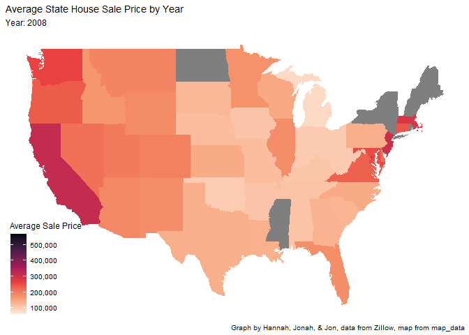

```{r setup, include=FALSE}
knitr::opts_chunk$set(echo = TRUE)
```

```{r}
#loading libraries
#my gt doesn't work, so I commented it out 
library(tidyverse)     # for data cleaning and plotting
library(gardenR)       # for Lisa's garden data
library(lubridate)     # for date manipulation
library(openintro)     # for the abbr2state() function
library(patchwork)     # for nicely combining ggplot2 graphs  
#library(gt)            # for creating nice tables
library(rvest)         # for scraping data
library(robotstxt)     # for checking if you can scrape data
library(janitor)       # for cleaning names

library(maps)          # for map data
library(ggmap)         # for mapping points on maps
library(gplots)        # for col2hex() function
library(RColorBrewer)  # for color palettes
library(sf)            # for working with spatial data
library(leaflet)       # for highly customizable mapping
library(ggthemes)      # for more themes (including theme_map())
library(plotly)        # for the ggplotly() - basic interactivity
library(gganimate)     # for adding animation layers to ggplots
library(transformr)    # for "tweening" (gganimate)
library(gifski)        # need the library for creating gifs but don't need to load each time
library(shiny)
theme_set(theme_minimal())
```

## R Markdown

This is an R Markdown document. Markdown is a simple formatting syntax for authoring HTML, PDF, and MS Word documents. For more details on using R Markdown see <http://rmarkdown.rstudio.com>.

When you click the **Knit** button a document will be generated that includes both content as well as the output of any embedded R code chunks within the document. You can embed an R code chunk like this:

```{r}
onebed_rent <- read_csv("City_MedianRentalPrice_1Bedroom.csv")
state_price <- read_csv("Sale_Prices_State.csv")
```


```{r}
state_price_averages <- state_price %>% 
  mutate( "2008" = rowMeans(select(.,`2008-03`:`2008-12`)), na.rm=TRUE,
          "2009" = rowMeans(select(.,`2009-01`:`2009-12`)), na.rm=TRUE,
          "2010" = rowMeans(select(.,`2010-01`:`2010-12`)), na.rm=TRUE,
          "2011" = rowMeans(select(.,`2011-01`:`2011-12`)), na.rm=TRUE,
          "2012" = rowMeans(select(.,`2012-01`:`2012-12`)), na.rm=TRUE,
          "2013" = rowMeans(select(.,`2013-01`:`2013-12`)), na.rm=TRUE,
          "2014" = rowMeans(select(.,`2014-01`:`2014-12`)), na.rm=TRUE,
          "2015" = rowMeans(select(.,`2015-01`:`2015-12`)), na.rm=TRUE,
          "2016" = rowMeans(select(.,`2016-01`:`2016-12`)), na.rm=TRUE,
          "2017" = rowMeans(select(.,`2017-01`:`2017-12`)), na.rm=TRUE,
          "2018" = rowMeans(select(.,`2018-01`:`2018-12`)), na.rm=TRUE,
          "2019" = rowMeans(select(.,`2019-01`:`2019-12`)), na.rm=TRUE) %>% 
  select(RegionName, "2008", "2009", "2010", "2011", "2012", "2013", "2014", "2015", "2016", "2017", "2018", "2019")

state_price_averages

```

```{r}
mean_price_year <- state_price_averages %>% 
  pivot_longer(cols = -RegionName,
    names_to = "years")
```


```{r, fig.alt= "This graph shows the average sale price of houses, by state, for each year 2008-2019. The most expensive homes were consistently found in California each year, and the most inexpensive homes are are found in Oklahoma. The more expensive the average price, the darker it is. The average sale price increases for most homes over this time period. When there is no data the states are gray."}
states_map<- map_data("state") 

state_price_year <- mean_price_year %>% 
  mutate(RegionName = str_to_lower(`RegionName`)) %>% 
  group_by(years) %>% 
  arrange(years) %>% 
  ggplot() + 
  geom_map(map = states_map,
           aes(map_id = RegionName,
               fill = value,
               group = years),
               na.rm = TRUE) +
  labs(title = "Average State House Sale Price by Year", 
       subtitle = "Year: {closest_state}",
       fill = "Average Sale Price", 
       caption = "Graph by Hannah, Jonah, & Jon, data from Zillow, map from map_data") +
  expand_limits(x = states_map$long, y = states_map$lat) + 
  scale_fill_viridis_c(option = "rocket", direction = -1) +
  theme_map() + 
  theme(legend.background = element_blank()) +
 transition_states(years, transition_length = 0)

state_price_year

animate(state_price_year, nframes = 200, end_pause = 10) 

```

```{r}
anim_save("state_price_year.gif")
```


```{r}

```

Line graphs showing the storm effects- 

```{r}
#hurricane sandy- line graphs showing the price changes over the 
```

```{r}
#have to edit this slightly to use the month by month data- 
hurricane_sandy <- mean_price_year %>% 
  mutate(RegionName = str_to_lower(`RegionName`)) %>% 
  group_by(mean_price) %>% 
  arrange(mean_price) %>%
  filter(RegionName == c("florida", "georgia", "south carolina", "north carolina", "virginia", "maryland", "deleware", "pennsylvania", "new jersey", "new york", "connceticut", "rhode island", "massacheusettes", "new hampshire", "maine")) %>% 
  ggplot(aes(y = value, 
             x = mean_price, 
             fill = fct_reorder(RegionName, value))) +
  geom_line() + 
  geom_text(aes(label = RegionName))+
  labs(title = "Cumulative Tomato Harvest by Variety",
       subtitle = "Date: {frame_along}",
      x = "",
      y = "Weight (lbs)",
      color = "RegionName",
      fill = "Tomato Variety") + 
  scale_color_gradientn(colors = rainbow(12))+
  transition_reveal(mean_price)
```


Note that the `echo = FALSE` parameter was added to the code chunk to prevent printing of the R code that generated the plot.
